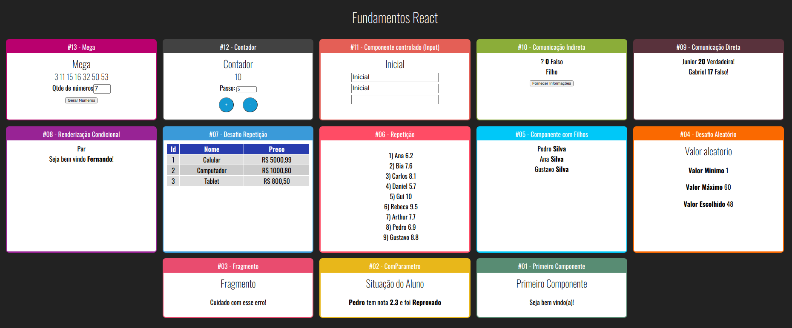
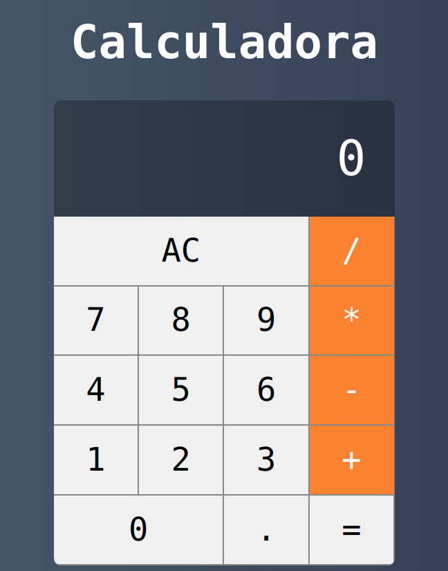

<h1 >curso-react-redux </h1>

1 - Crie a pasta onde os projetos ficarão dentro; 

2- Crie o projeto react com o comando abaixo (esse comando não é de forma global): 

 npx create-react-app nomeProjeto 

<h2>Fundamentos </h2>
    
Realizados 13 exercícios a fim de aplicar os fundamentos do React 

    
<h2>Calculadora </h2>
    
Desenvolvido uma calculadora que realiza as quatro operações básicas, baseado na calculadora so sistema operacional IOS 

    